## Main Contributor
Pranav Balaji Balachandran

## Overview
This project is a real-time productivity tracker for a single person using a webcam. It detects whether the person is present in front of the screen and continuously tracks the amount of time they are distracted using YOLO V8.
- Key Features:
  - Real-time person detection using YOLOv8.
  - Continuous distraction timer in HH:MM:SS format.
  - Bounding box visualization for the detected person.
  - Total distraction time accumulates even after multiple absences.
 
## Table of Contents
- [Architecture Diagram](#architecture-diagram)
- [Functionalities](#Functionalities)
- [License](#license)
## Architecture diagram

```mermaid
graph LR
    %% Style for topics (rounded rectangles with colored fill and border)
    style VideoFrames stroke:#3498DB,stroke-width:3px,fill:#5DADE2,rx:10,ry:10,color:#222
    style PersonDetections stroke:#3498DB,stroke-width:3px,fill:#5DADE2,rx:10,ry:10,color:#222
    style DistractionTimer stroke:#3498DB,stroke-width:3px,fill:#5DADE2,rx:10,ry:10,color:#222
    style TotalDistraction stroke:#3498DB,stroke-width:3px,fill:#5DADE2,rx:10,ry:10,color:#222

    %% Nodes (components)
    style Webcam stroke:#000,stroke-width:2px,fill:#fff,color:#000
    style YOLOv8 stroke:#000,stroke-width:2px,fill:#fff,color:#000
    style TimerLogic stroke:#000,stroke-width:2px,fill:#fff,color:#000
    style Display stroke:#000,stroke-width:2px,fill:#fff,color:#000

    %% Components
    Webcam["Webcam / External Camera"]
    YOLOv8["YOLOv8 Person Detection"]
    TimerLogic["Distraction Timer Logic"]
    Display["Output Display (OpenCV Window)"]

    %% Topics
    VideoFrames["/video_frames"]
    PersonDetections["/person_detections"]
    DistractionTimer["/running_distraction_timer"]
    TotalDistraction["/total_distraction_time"]

    %% Flow
    Webcam -->|Captured Frames| VideoFrames
    VideoFrames --> YOLOv8
    YOLOv8 -->|Bounding Boxes + Confidence| PersonDetections
    PersonDetections --> TimerLogic
    TimerLogic -->|Running Timer| DistractionTimer
    TimerLogic -->|Accumulated Time| TotalDistraction
    TimerLogic --> Display
    YOLOv8 --> Display
```

## Functionalities
- Webcam / External Camera Input
  - Captures live video frames continuously.
  - Can use built-in webcam (cv2.VideoCapture(0)) or an external camera feed.
  - Provides input frames to the detection module.
- YOLOv8 Person Detection
  - Uses pre-trained YOLOv8 model (yolov8n.pt) for person detection.
  - Detects bounding boxes around person(s) in each frame.
  - Filters detections based on confidence threshold (e.g., >0.5).
  - Outputs detected person coordinates (x1, y1, x2, y2) and confidence.
- Distraction Detection Logic
  - Determines if the person is present in the frame.
  - If absent: starts a real-time distraction timer.
  - If present: stops the timer and adds elapsed time to total distraction.
  - Uses continuous timer calculation so the timer counts in real-time while the person is away.
- Distraction Timer
  - Measures current distraction period while person is absent.
  - Accumulates total distraction time across multiple absences.
  - Displays running timer in HH:MM:SS format for readability.
- Visualization / Output Display
  - Draws bounding box around the detected person.
  - Shows label “Person” above the bounding box.
  - Displays running distraction timer on screen.
  - Provides real-time feedback on total distraction duration.
  - System Control
  - Press q to exit the program.

## License

This project is licensed under the **Apache 2.0 License** - see the [LICENSE](LICENSE) file for details.
